# Virtual-Interview-Platform

## Hosted at URL -- ( https://virtual-interview-platform.herokuapp.com/ ) @ Check It Out

### Q. Is there any open source proper online platform for conducting/managing  interview during the time of pandemic and post pandemic period?
#### The aim of this Project is to allow students and recruiter to meet and interact using Video, Chats and Web-Conferencing Services any time. Designed to fullfill the modern day interview requirements all in one website!!! And fullfills all needs of both the candidate and interviewer. This Application also provides instant result of all participated candidates efficiently.

## Contributors : [Prerit Kumar Jha](https://github.com/prerit2001), [Nalin Agrawal](https://github.com/nalin-programmer), [Amit Kumar Upadhaya](https://github.com/mit1275)

### Some Pics :

<pre>
  <b>                                                     HOME</b>
  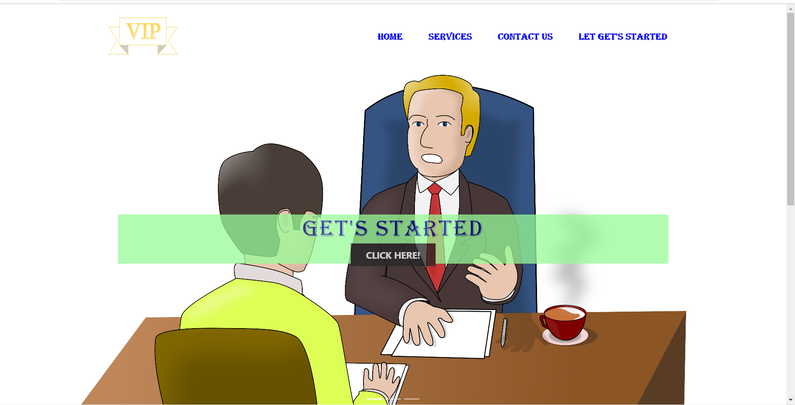  
  <b>                                                   FEATURES</b>
  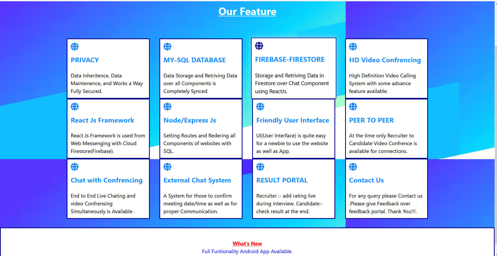  
  <b>                      SIGNIN                                                 INFORMATION FORM
  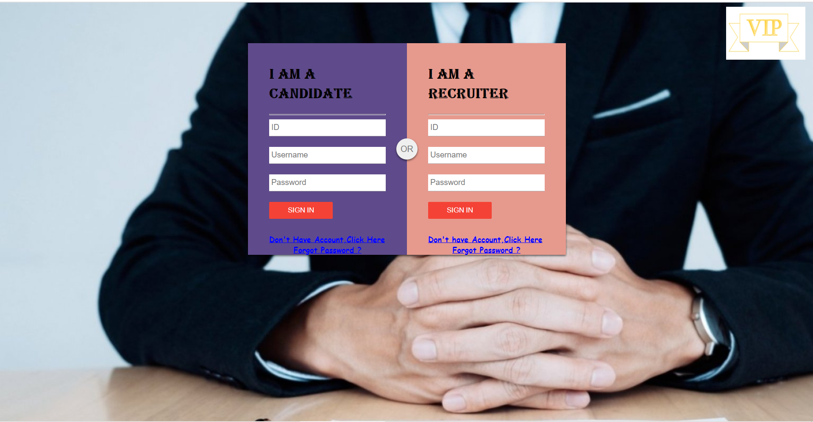    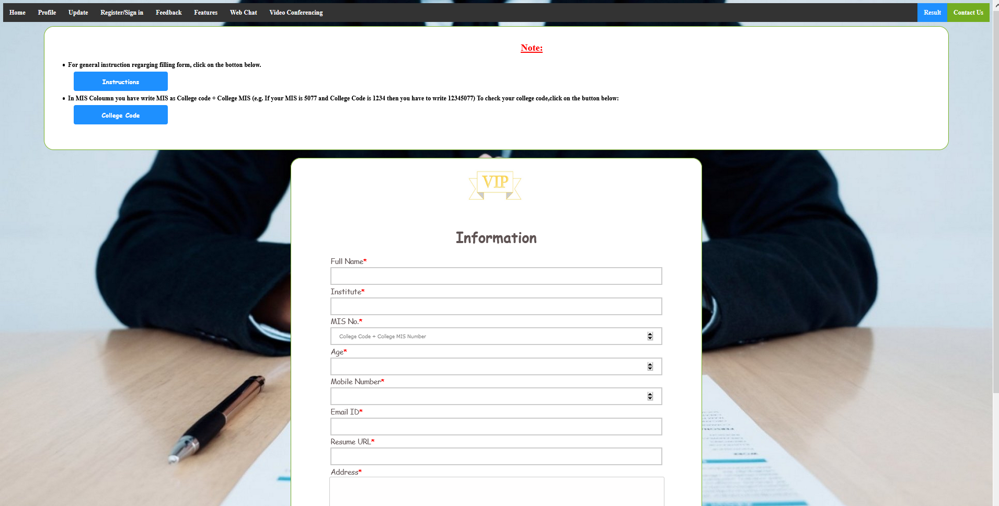 
                           WEB-CHAT                                              CONFRENCING SYSTEM
  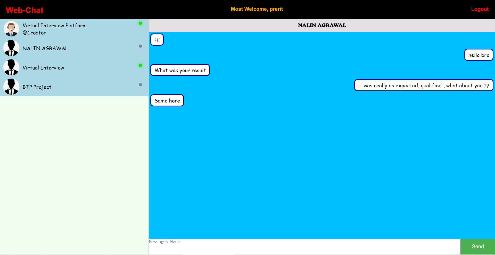    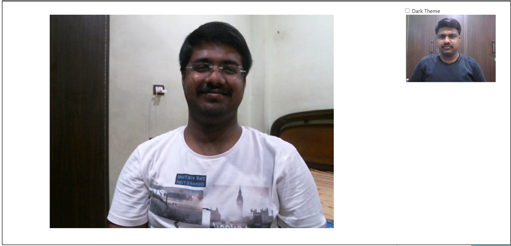 
                         RESULT PORTAL                                            RESULT-VIEW
  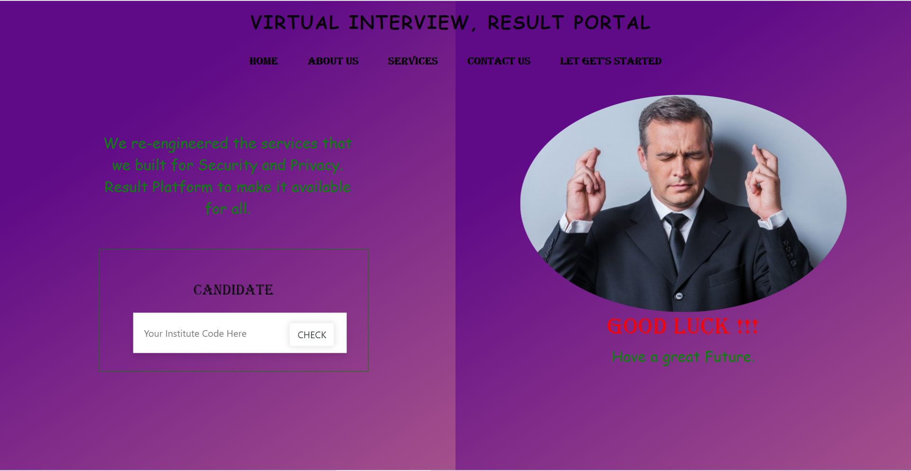    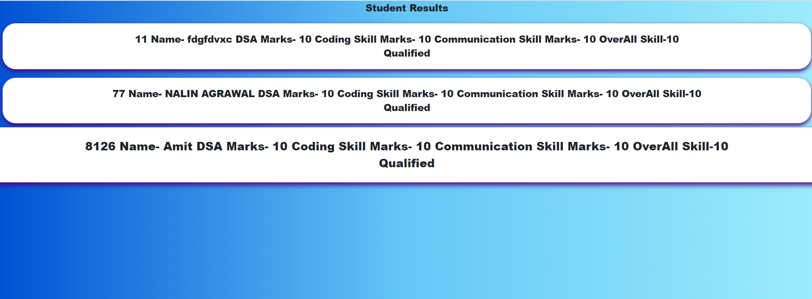  
                            FORGET                                                  FEEDBACK
  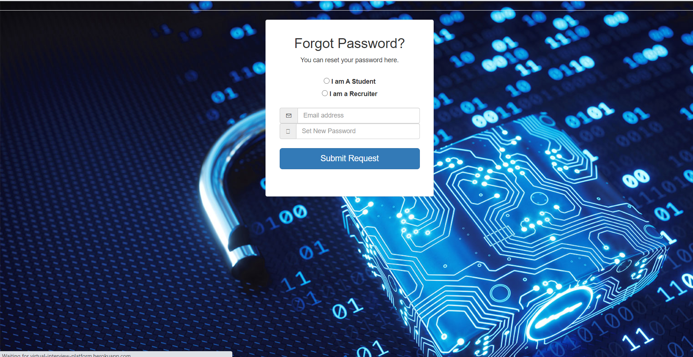    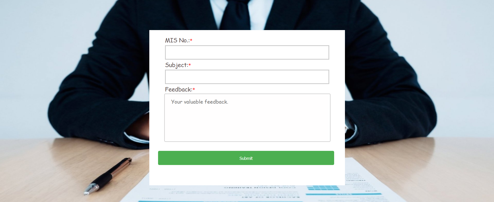  
                                                     CONTACT US
  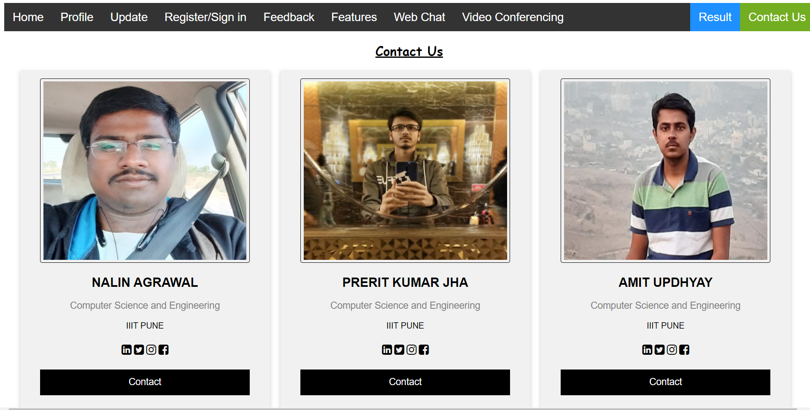  
  </b>
</pre>
