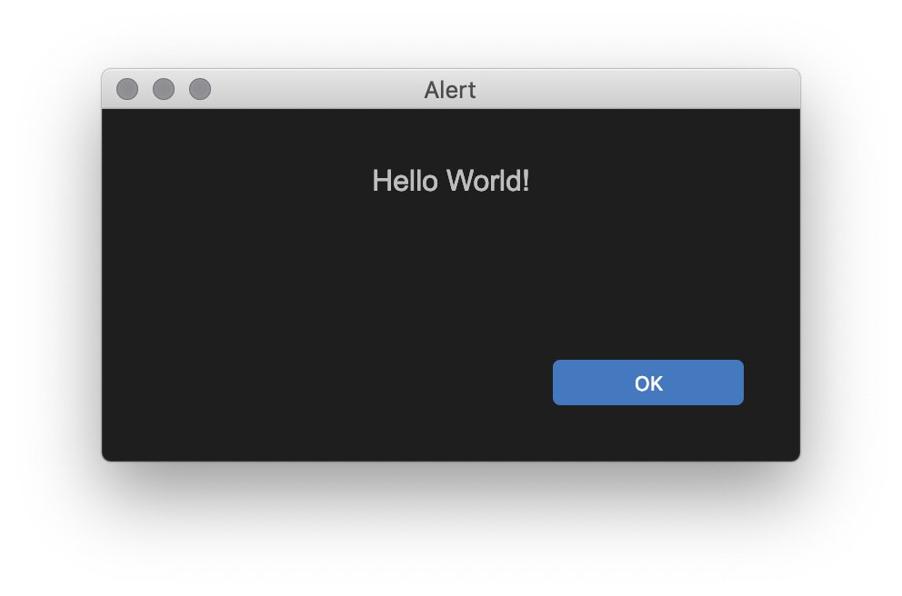
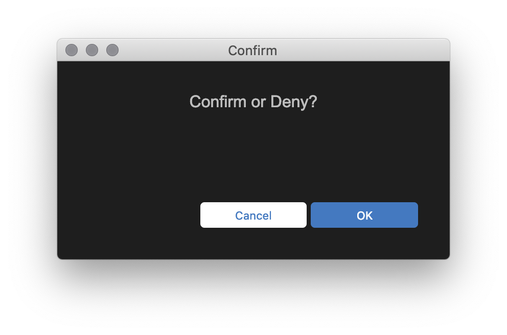
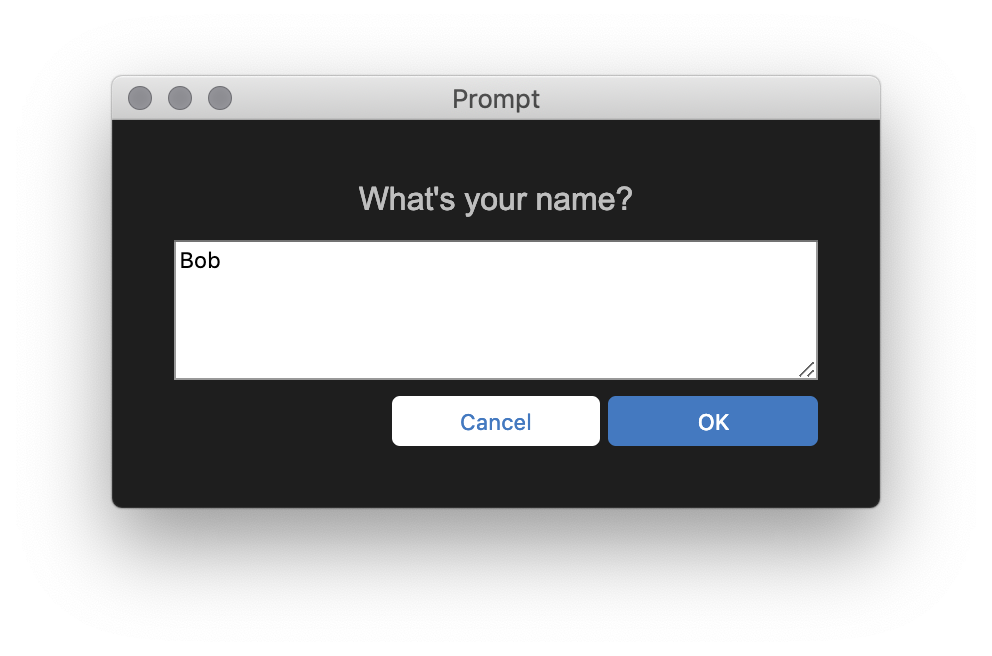
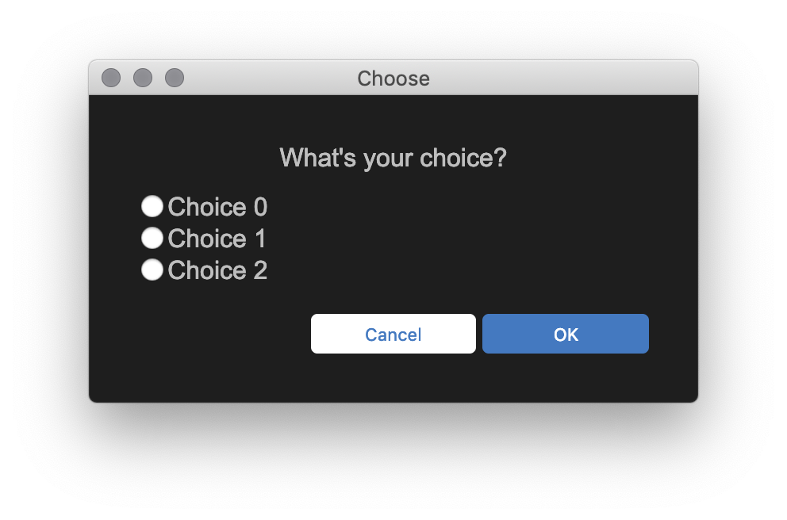
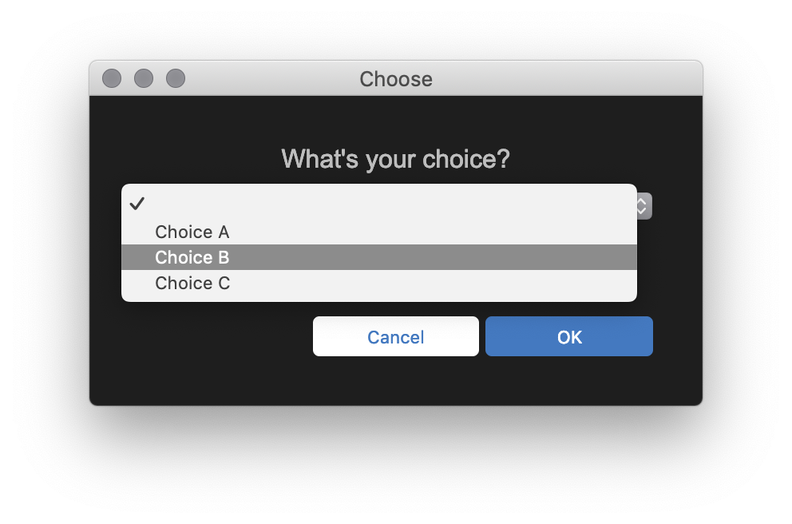
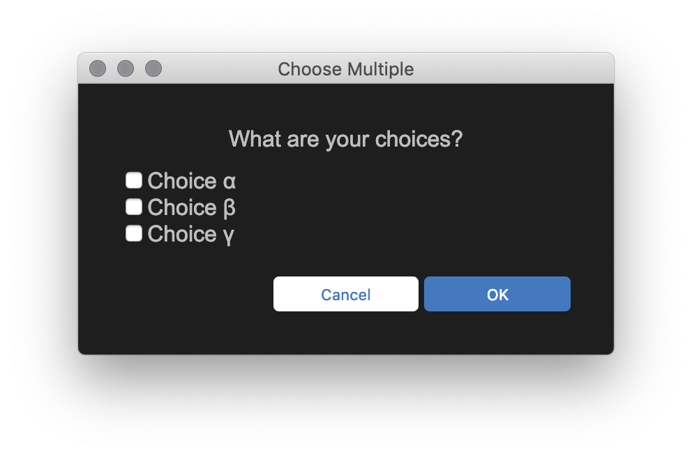

# Node Popup

Simulates browser-style popups (**alert**, **confirm**, and **prompt**) from the commandline using a promise based API.
Additional alerts (**choose**, **choosedropdown**, and **choosemultiple**)

Note: this project uses [carlo](https://github.com/GoogleChromeLabs/carlo) and you'll need a copy of [chrome](https://www.google.com/chrome/) installed for this it to work.

## Demo

This demo shows the six different types of included popups.

Note: The last three questions will be graded

```sh
git clone <this repository>
cd <cloned folder>
npm install
npm run demo
```


## Installation

```sh
npm install node-popup
```

## Export

## Common JS Module

The default export is a common js module.

```javascript
const popup = require('node-popup');
```

```javascript
const popup = require('node-popup/dist/cjs.js');
```

## Bundler

If you're using some sort of package buldler, you can import the default module as an es6 module.

```javascript
import * as popup from 'node-popup';
```

### Typescript Source

The Typescript source is available... especially useful when bundled as a submodule.

```javascript
import * as popup from 'node-popup/src/index.ts';
```

## ES Module

An ecmascript module is available for use with node's "--experimental-modules" flag.
Note: since this is experimental, this may not work.

```javascript
import * as popup from 'node-popup/dist/esm.mjs';
```

## Usage

## Alert

Simulate an alert box.

```javascript
import {alert} from 'node-popup';
alert('Hello World!');
```



## Confirm

Simulate a confirm box.

Note: popup functions will retun a promise that will be rejected if the window is closed or the "cancel" button is clicked.

```javascript
import {confirm} from 'node-popup';
const main = ()=>{
    try{
        await confirm('Confirm or Deny?');
        console.log('Confirmed!');// OK button clicked
    }catch(error){
        console.log('Denied!');// cancel button clicked
    }
}
main();
```



## Prompt

Simulate a prompt box.

Note: The answer returned is a string.

```javascript
import {prompt} from 'node-popup';
const main = ()=>{
    try{
        const name = await prompt('What\'s your name?', 'Bob');
        console.log(`Hello ${name}`);// OK button clicked
    }catch(error){
        console.log('Canceled!');// cancel button clicked
    }
}
main();
```



## Choose and Choosedropdown

Like **prompt**, but with multiple choices instead of a free text box.

Using **choose** will present a list of answers as radio buttons.

```javascript
import {choose} from 'node-popup';
const main = ()=>{
    try{
        const name = await choose('What\'s your choice?', 'Choice 0', 'Choice 1', 'Choice 2');
        console.log(`You choose: ${prompt}`);// OK button clicked
    }catch(error){
        console.log('Canceled!');// cancel button clicked
    }
}
main();
```



Using **choosedropdown** will present a list of answers as radio buttons.

```javascript
import {choosedropdown} from 'node-popup';
const main = ()=>{
    try{
        const choice = await choosedropdown('What\'s your choice?', 'Choice A', 'Choice B', 'Choice C');
        console.log(`You have chosen: ${choice}`);// OK button clicked
    }catch(error){
        console.log('Canceled!');// cancel button clicked
    }
}
main();
```



## Choosemultiple

Like **choose**, but with multiple answers selected via checkboxes.

Note: The answer returned is an array of strings.

```javascript
import {choosemultiple} from 'node-popup';
const main = ()=>{
    try{
        const choices = await choosemultiple('What are your choices?', 'Choice α', 'Choice β', 'Choice γ');
        console.log(`Your choices are ${choice.join(',')}`);// OK button clicked
    }catch(error){
        console.log('Canceled!');// cancel button clicked
    }
}
main();
```



## Custom Popups

You can create customized popups.

```javascript
import {customized} from 'node-popup';

const customizedPopup = customized({
    pageBody,// Body of page to use. See ./pages.js for options
    style, // Style. See ./style.css for default. Note: css containing character '>' currently fails
    top = defaultOptions.top, // Top of window
    left = defaultOptions.left, // Left of window
    width = defaultOptions.wdith, // Width of window
    height = defaultOptions.height, // Height of window
    title = defaultOptions.title // Title of window
});
```

## Debugging

This can be useful for quick debugging; but should be viewed as an anti-pattern.
